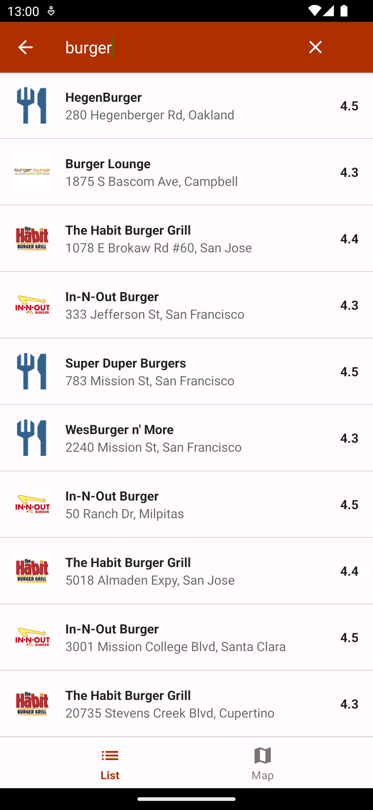
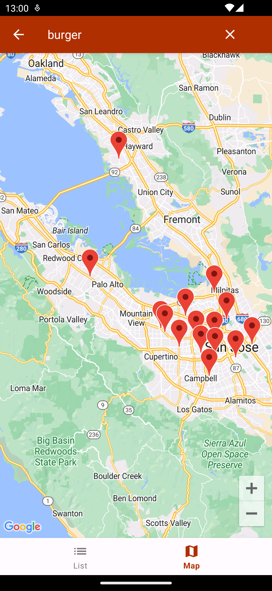
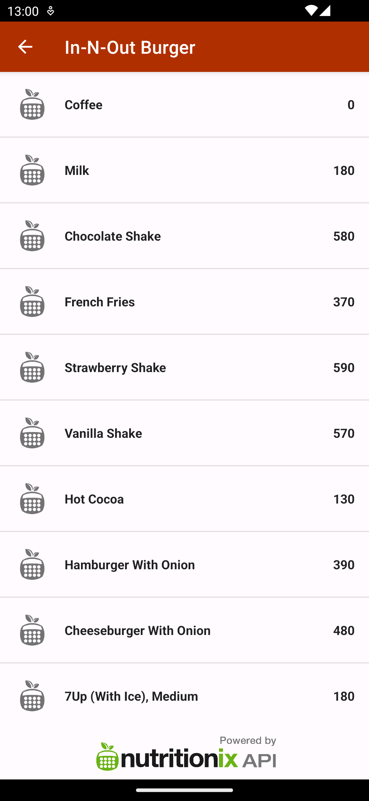

RestoSearch
============================
An Android app for searching nearby restaurants using Google Maps API
and displaying menu items using Nutritionix API.

TODO:
 - Add Google Maps API key as MAPS_API_KEY in the local.properties file
 - Add NUTRITIONIX_APP_ID and NUTRITIONIX_API_KEY in the local.properties file

Screenshots:

